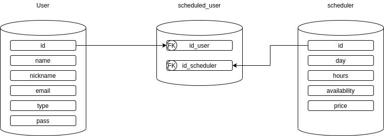

# Sistema de agendamento

## Description:

This is a portfolio repository with the objective of training. The API below allows the creation of an agenda and management with user rules.

## API documentation:

[Postman: sistema-de-agendamento](https://documenter.getpostman.com/view/13683623/TVsshT9X)

## Main Technologies:

- Typescript
- Express
- MySQL

## Getting started with the sistema-de-agendamento server:

1. Clone this repo using:

    ```jsx
    $ git clone https://github.com/renemonteiro/sistema-de-agendamento.git
    ```


2. Create dotenv file:

    ```jsx
    $ touch .env
    ```

3. Insert the environment variables on dotenv:

    ```
    DB_HOST = 
    DB_NAME = 
    DB_PASSWORD = 
    DB_USER = 
    
    JWT_KEY = 
    
    BCRYPT_COST =
    
    MAILER_PASSWORD = 
    MAILER_USER =
    ```

4. Install dependencies:

    ```jsx
    $ npm install
    ```

5. Run the project: 

    ```jsx
    $ npm run start 
    #or
    $ npm run dev
    ```

## Database structure:

 


